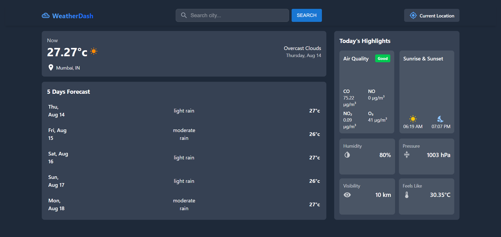

# 🌦️ Weather App

 <!-- Replace with your banner image -->

A responsive weather dashboard with **live API data**, **geolocation detection**, **5-day forecast**, and **interactive temperature trend charts**.

---

## 🚀 Live Demo  
🔗 [View Live](https://weather-app-pi-eight-xdj1fl5g0t.vercel.app/)  
💻 [GitHub Repo](https://github.com/aimgodheretest/WeatherApp)

---

## 🛠 Tech Stack  
  
  

---

## ✨ Features  
- 🌍 Real-time weather updates by city or geolocation  
- 📅 5-day forecast display  
- 📊 Interactive temperature charts  
- 📱 Fully responsive UI  

---

## 📸 Screenshots  
 <!-- Replace with actual screenshot -->

---
